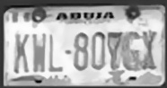
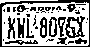
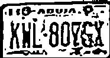

# Number Plate Detection and Recognition

This project focuses on detecting vehicle number plates from images and videos using YOLOv8 and extracting text using Optical Character Recognition (OCR). It leverages a custom-trained YOLO model and EasyOCR for accurate number plate recognition in diverse scenarios.

# Resources

Images Dataset (Training and Test) : https://makeml.app/datasets/cars-license-plates%7D 

---

## 🚀 Project Features

* License plate detection using YOLOv8
* Text recognition using EasyOCR
* Real-time video processing
* Image preprocessing pipeline for improved OCR accuracy
* Output annotated images and video with bounding boxes and detected plate numbers

---

## 📁 Folder Structure

```
number-plate-detection/
├── runs/                      # YOLO training and prediction outputs
├── datasets/                 # Training images and labels
│   ├── images/
│   └── labels/
├── yolov8/                   # YOLO config and training scripts
├── assets/                   # YOLO config and training scripts
│   └── datasets/data.yaml             # Dataset config
├── main.py                   # Script to train and test on images
├── video_ocr.py              # Script for video processing and OCR
├── README.md
```

---

## 🧠 Model Training Steps

1. **Prepare Dataset**:

   * Collected two sets of images: full cars and cropped number plates.
   * Annotated bounding boxes using XML format.
   * Converted XML annotations to YOLO format.

2. **Create YAML Config**:

```yaml
path: datasets
train: images/train
val: images/val
names:
  0: licence
```

3. **Train YOLOv8 Model**:

```bash
yolo task=detect mode=train model=yolov8n.pt data=yolov8/alpr.yaml epochs=20 imgsz=640
```

* Output saved in `runs/detect/train*/weights/best.pt`

4. **Test on Static Image**:

```python
from ultralytics import YOLO
model = YOLO("runs/detect/train*/weights/best.pt")
model.predict(source="screenshot.png", save=True)
```

---

## 🖼 Image OCR Pipeline

1. Crop detected plate from image
2. Resize and denoise the plate
3. Convert to grayscale and apply thresholding
4. Run EasyOCR

```python
reader = easyocr.Reader(['en'])
results = reader.readtext(morphed)
```

---

## 🎥 Video Analysis

1. Process each frame of the video
2. Resize and run YOLOv8
3. Rescale bounding boxes back to original resolution
4. Draw boxes, crop plate region
5. Preprocess and run OCR
6. Save final annotated video

```python
cv2.VideoWriter("output_annotated_video.mp4", ...)
```

---


## 🔁 Annotation Conversion

To use Pascal VOC XML annotations (e.g., from LabelImg), convert them to YOLO format using `xml_to_yolo.py`.

### Example Usage:

```python
convert_voc_to_yolo("annotations", "labels")
```

### Sample Output Format:

```
0 0.445000 0.612500 0.150000 0.100000
```

Each line represents:

```
class_id center_x center_y width height (all normalized)
```

Ensure `class_map` in the script matches your labels:

```python
class_map = {'licence': 0}
```

---

## 📊 Results and Observations

* YOLOv8 model trained on custom dataset detected plates with high accuracy in both near and distant views.
* EasyOCR extracted plate numbers accurately after preprocessing (resizing, denoising, thresholding).
* Bounding box misalignment in video was resolved by scaling detection coordinates.
* Pipeline works on diverse images and real-world videos.

---

### 🖼 Sample Outputs

#### 1. Detected Plate from Image





#### 2. Cropped and Processed Plate


#### 3. Annotated Frame from Video


## 📌 Future Improvements

* Implement tracking to avoid duplicate OCR on the same plate
* Export detected plate data to CSV or database
* Deploy as a Streamlit or Flask web app for easy use
* Use denoising autoencoders to clean noisy plates


